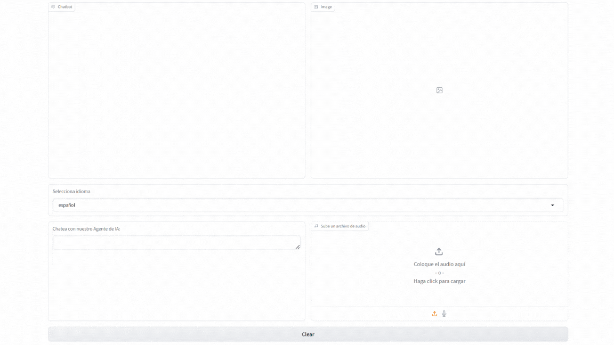

# LLM Multimodal Travel Agent
This project implements a highly personalized multimodal agent for airline ticket reservations and customer service, utilizing various agents to **retrieve specific information** about available tickets and destinations. The agent maintains a smooth conversation with users, facilitating the ticket sales process. It is powered by OpenAI's **GPT-4** (text), **Whisper** (audio), and **DALL-E** (images) models, along with **Claude** by Anthropic (text) for translations, enabling a multilingual, high-quality experience.

## Features

- **Multilingual Support**: Communicate in English, Spanish, and French
- **Voice Interaction**: Upload audio messages that get automatically transcribed
- **Visual Content**: Generates artistic representations of destinations
- **Document Generation**: Creates reservation confirmations in PDF and Word formats
- **Real-time Price Checking**: Instant access to ticket prices for various destinations
- **Text-to-Speech**: Converts responses to spoken audio



# Requirements

To set up this project, follow the instructions below.

### 1. Install Libraries using `requirements.txt`

To install the necessary libraries, simply run the following command in your terminal:

```bash
pip install -r requirements.txt -q
```
This will install all the required libraries listed in the requirements.txt file.

### 2. Set Up Your .env File
You'll need to create a .env file to store your API keys. The file should have the following structure:
```bash
OPENAI_API_KEY=sk......
ANTHROPIC_API_KEY=sk......

```
Replace sk...... and ..... with your actual API keys.
The .env file should be stored in the root directory of the project.

### 3. .gitignore Configuration
To ensure that sensitive files like your .env are not uploaded to GitHub, create a .gitignore file in your project’s root directory and add the following line:
```bash
.env
```
This ensures that the .env file is excluded from version control, keeping your API keys secure.

## ✈️ Core Functionalities  

### 🌍 Flight Information  
- View available flight destinations  
- Check ticket prices for specific routes  
- Make flight reservations  
- Generate reservation confirmation documents  

### 🤖 AI Features  
- **🎤 Audio Transcription:** Converts uploaded audio to text using OpenAI's Whisper  
- **🖼️ Image Generation:** Creates destination-themed images using DALL·E  
- **🌐 Language Translation:** Provides multilingual support using Claude  
- **🔊 Text-to-Speech:** Converts responses to audio using OpenAI's TTS  

### 📄 Document Generation  
- Creates reservation confirmations in **DOCX** format  
- Automatically converts **DOCX to PDF**  
- Includes customized details such as:  
  - **📅 Reservation date**  
  - **🏝️ Destination**  
  - **💰 Ticket price**  

## 🖥️ User Interface  

### 🏗️ The Gradio-based UI includes:  
- **💬 Chat interface** with message history  
- **🖼️ Image display area** for generated travel images  
- **🌐 Language selection dropdown**  
- **🎵 Audio file upload option**  
- **⌨️ Text input field** for typing messages  
- **🗑️ Clear chat button**  

## ⚙️ Technical Components  

### 🔧 Main Functions  
- `chat()`: Handles conversation flow and tool integration  
- `transcribe_audio()`: Processes audio input to text  
- `create_image()`: Generates destination images  
- `write_docs()`: Creates reservation documents  
- `get_translation()`: Handles language translation  
- `handle_tool_call()`: Manages function calls and responses  

## 🛠️ Tools Integration  
- **💲 Price queries**  
- **📅 Reservation processing**  
- **🌐 Translation services**  
- **📖 Flight catalogue access**  

## 🚨 Error Handling  
The application includes comprehensive error handling for:  
- **❌ API failures**  
- **⚠️ Invalid input data**  
- **📂 File processing errors**  
- **🈳 Translation issues**  

## ▶️ Running the Application  
Run the code:  
```bash
main.ipynb
```

Notes
-----
- Requires active API keys for full functionality
- Limited to predefined destinations and prices
- Audio files must be in a compatible format
- Template files must be present for document generation

License
-------


This project is licensed under the MIT License - see the [LICENSE](./LICENSE) file for details.